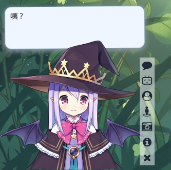
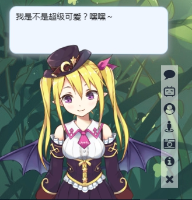
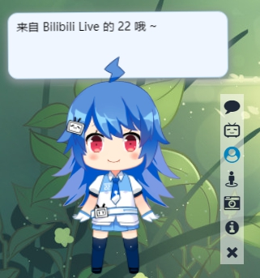
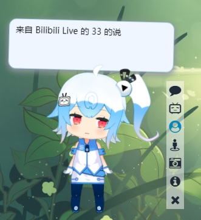
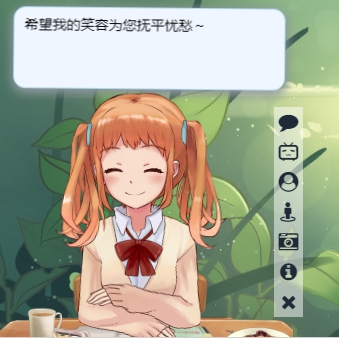
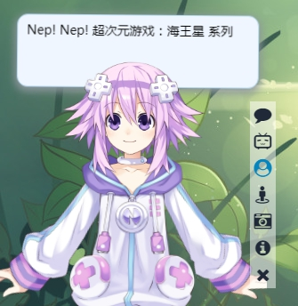
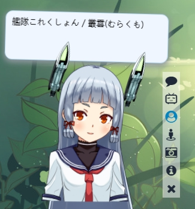

# live2d-widget

live2D看板娘，基于 [live2d-widget](https://github.com/stevenjoezhang/live2d-widget) 修改，专为自己博客使用，如果您有需要，也可以下载使用。

适应 [hexo-theme-butterfly](https://github.com/jerryc127/hexo-theme-butterfly) 主题，添加了B站图标，修改自定义内容。

## 使用

在 `<head>` 中加入下面两行，因为需要Font Awesome和iconfont支持，请确保相关样式表已在页面中加载，否则无法正常显示，如果网页中已经加载了 Font Awesome，就不要重复加载了，仅需要加载`iconfont`即可。

```html
<link rel="stylesheet" href="https://cdn.jsdelivr.net/npm/font-awesome/css/font-awesome.min.css">
<link rel="stylesheet" href="https://cdn.jsdelivr.net/gh/SaraKale/sarakale.github.io/blog/css/iconfont/iconfont.css">
```
iconfont是来自 [hexo-theme-nexmoe](https://github.com/nexmoe/hexo-theme-nexmoe)，因为要加载B站图标。

然后将这一行代码加入 `<head>` 或 `<body>`，即可展现出效果：
```html
<script src="https://cdn.jsdelivr.net/gh/sarakale/live2d-widget@master/autoload.js"></script>
```

一般在主题的"layout/_layout.swig"中修改，我是使用了[hexo-theme-butterfly](https://github.com/jerryc127/hexo-theme-butterfly)这个主题，所以要在 `butterfly/layout/includes/layout.pug` 文件的`body`末尾加入，注意空格缩进：
```js
head
  include ./head.pug
body

  ..........

  include ./rightside.pug
  !=partial('includes/search/index', {}, {cache:theme.fragment_cache})
  each item in theme.CDN_USE.js
    script(src=url_for(item))
  include ./additional-js.pug
  //- live2d 看板娘
  script(src="https://cdn.jsdelivr.net/gh/sarakale/live2d-widget@master/autoload.js")
```

## 修改

- `waifu-tips.js` 是live2d主要文件，如果对javescript不熟悉建议不要贸然修改。
- `waifu-tips.json` 是显示的对话文字，可以修改为自己想要设定的内容。
- `waifu.css` 是看板娘的样式表，如要修改样式可在这里修改。

适应 [hexo-theme-butterfly](https://github.com/jerryc127/hexo-theme-butterfly)，如果是其他主题，可能需要自行相应修改。

`waifu-tips.js` 第17行到27行之间可以修改图标样式名，我这里删除了原来的fa-paper-plane，因为不需要这类所以改成了B站，也可以自行增添。
在59行修改为你的B站地址：
```js
document.querySelector("#waifu-tool .icon-bilibili").addEventListener("click", () => {
  open("改成你的B站地址");
});
```
第166行可以修改模型ID，ID的数字具体打开浏览器按F12看控制台输出的报告，或者可以看[模型预览](#模型预览)
```js
// 首次访问加载指定模型和指定材质
modelId = 1; // 模型 ID
modelTexturesId = 0; // 材质 ID
```

`waifu-tips.json` 是触发的对话文字内容，可以修改自己设定的文字和你主题的样式图标，每对话中间要有逗号（英文状态下）隔开。

`waifu.css` 是看板娘的样式表，如果自己有CSS基础，可以自行修改，我这里新增了butterfly主题夜间模式适应。

## 自定义CDN

也可以自己自定义内容，上传到自己的服务器，可以把当前仓库克隆下载，然后进行修改。

克隆仓库
```
git clone https://github.com/SaraKale/live2d-widget.git
```
然后别忘了在 `autoload.js` 修改live2d_path地址
```js
const live2d_path = "https://cdn.jsdelivr.net/gh/username/live2d-widget@master/";
```
将 `username` 替换为你的 GitHub 用户名即可。

也别忘了在`<head>` 或 `<body>`加载autoload.js文件
```html
<script src="https://cdn.jsdelivr.net/gh/username/live2d-widget@master/autoload.js"></script>
```

## 模型预览

在[我的博客](https://sarakale.github.io/blog)可以查看效果。

**1-0**


**2-0**


**3-0**


**4-0**


**5-0**


**6-0**


**7-0**


## 参考资料

更多内容可以参考：  
https://imjad.cn/archives/lab/add-dynamic-poster-girl-with-live2d-to-your-blog-02  
https://github.com/xiazeyu/live2d-widget.js  
https://github.com/summerscar/live2dDemo

还可以自行搭建后端 API，并增加模型（需要修改的内容比较多，此处不再赘述）：  
https://github.com/fghrsh/live2d_api  
https://github.com/xiazeyu/live2d-widget-models  
https://github.com/xiaoski/live2d_models_collection


